# GymFlow – مستند جامع پروژه (راهنمای کامل)

## 🎓 ارائه پروژه تحصیلی

> **دانشجو:** میکائیل جرجانی (Mikaeeil Jorjany)  
> **رشته:** مهندسی حرفه‌ای کامپیوتر (کارشناسی پیوسته)  
> **دانشگاه:** دانشگاه ملی مهارت پسران گرگان  
> **استاد راهنما:** استاد میلاد یانپی  
> **ترم:** هشتم (ترم پایانی)  
> **شماره دانشجویی:** `01131123907502`  
> **ایمیل:** mikaeeiljorjany@gmail.com

---

## فهرست مطالب

1. [خلاصه اجرایی](#-خلاصه-اجرایی)
2. [تحلیل رقبا و جایگاه GymFlow](#-تحلیل-رقبا-و-جایگاه-gymflow)
3. [نمای کلی پروژه](#-نمای-کلی-پروژه)
4. [تصاویر و گالری رابط کاربری](#-تصاویر-و-گالری-رابط-کاربری)
5. [معماری سیستم](#-معماری-سیستم)
6. [طراحی پایگاه داده و روابط موجودیت‌ها](#-طراحی-پایگاه-داده-و-روابط-موجودیت‌ها)
7. [ویژگی‌های اصلی](#-ویژگی‌های-اصلی)
8. [پشته فناوری](#-پشته-فناوری)
9. [بررسی عمیق مؤلفه‌های کلیدی](#-بررسی-عمیق-مؤلفه‌های-کلیدی)
10. [استراتژی تست](#-استراتژی-تست)
11. [نقش هوش مصنوعی در توسعه](#-نقش-هوش-مصنوعی-در-توسعه)
12. [نقشه راه آینده](#-نقشه-راه-آینده)
13. [نصب و راه‌اندازی](#-نصب-و-راه‌اندازی)
14. [نتیجه‌گیری](#-نتیجه‌گیری)

---

## 🏆 خلاصه اجرایی

**GymFlow** یک سیستم مدیریت تمرین و ارتباط مربی-کارآموز است که به عنوان پروژه پایانی مقطع کارشناسی طراحی و پیاده‌سازی شده است. هدف اصلی، پر کردن شکاف میان **نرم‌افزارهای صرفاً اداری** (که عمدتاً روی ثبت‌نام، حسابداری و کنترل تردد تمرکز دارند) و **نیاز واقعی مربیان و ورزشکاران** به ابزاری برای برنامه‌دهی تخصصی تمرین، نظارت بر پیشرفت و تحلیل داده‌های عملکردی است.

```
مشکل واقعی → راه‌حل هدفمند → نوآوری در تمرکز
```

- **مربیان** برای طراحی برنامه تمرینی شخصی‌سازی‌شده و پیگیری چندین ورزشکار به صورت همزمان با چالش روبه‌رو هستند.
- **ورزشکاران** فاقد ابزاری برای ثبت دقیق تمرینات، مشاهده روند پیشرفت و دریافت بازخورد تحلیلی می‌باشند.
- **GymFlow** این شکاف را با ارائه یک پلتفرم دوگانه (مربی/کاربر) و تمرکز بر **ارزش‌آفرینی در فرآیند تمرین** پر می‌کند.

امکانات کلیدی:

- 👨‍🏫 **داشبورد مربی** – مدیریت مشتریان، ایجاد برنامه‌های تمرینی فازبندی‌شده، نظارت بر پیشرفت وزنی و تمرینی
- 🧑‍🎓 **داشبورد کاربر** – ثبت تمرین، پیگیری وزن، مشاهده دستاوردها، دریافت پیش‌بینی هوشمند وزن
- 🔒 **احراز هویت امن** – Basic Authentication برای محافظت از APIهای حساس
- 📊 **تحلیل داده‌محور** – پیش‌بینی وزن، نمره ثبات، نشان‌های افتخار
- 📁 **گزارش‌گیری حرفه‌ای** – خروجی PDF از برنامه تمرینی، گزارش پیشرفت و گواهی دستاوردها

> 💡 **نقطه تمایز اصلی:** برخلاف نرم‌افزارهای سنتی مدیریت باشگاه که بر **مدیریت مالی و اداری** متمرکزند، GymFlow هسته خود را حول **ارتباط حرفه‌ای مربی-کارآموز** و **ابزارهای تخصصی برنامه‌دهی تمرین** طراحی کرده است.

---

## 🔍 تحلیل رقبا و جایگاه GymFlow

### وضعیت موجود نرم‌افزارهای مدیریت باشگاه در ایران

بررسی نمونه‌های شاخص بازار نشان می‌دهد که بیشتر راه‌حل‌های موجود بر جنبه‌های زیر متمرکز شده‌اند:

| **محصول** | **نقاط قوت** | **نقاط ضعف (از دیدگاه مربی/ورزشکار)** |
|:---|:---|:---|
| **ورزش سافت** | اتوماسیون جامع اداری، اتصال به سخت‌افزار (قفل، گیت)، مدیریت مالی و بوفه | فاقد سیستم اختصاصی برنامه‌دهی تمرین و ابزارهای تعامل مربی-کارآموز |
| **ویپینگ (CRM)** | ابزارهای بازاریابی، مدیریت ارتباط با مشتری، اتوماسیون پیامک | تمرکز بر فروش و جذب مشتری، نه بر فرآیند تمرین و پیشرفت ورزشی |
| **تایگر** | یکپارچگی با سخت‌افزار (کمد آنلاین، گیت)، امنیت بالا | محدود به مدیریت تردد و کمد، فاقد ماژول برنامه‌دهی و تحلیل تمرین |

### جایگاه متفاوت GymFlow

GymFlow با درک این خلأها، معماری و قابلیت‌های خود را بر پایه‌ی **ارزش‌آفرینی برای طرفین ماجرا** بنا نهاده است:

✅ **تمرکز ویژه بر فرآیند مربیگری**  
امکان طراحی برنامه تمرینی فازبندی‌شده (Phase 1, 2, …)، تعیین حرکات، ست، تکرار، استراحت و هدف عضلانی برای هر روز – چیزی که در سیستم‌های صرفاً اداری دیده نمی‌شود.

✅ **تحلیل پیشرفت و پیش‌بینی هوشمند**  
محاسبه روند تغییرات وزن، پیش‌بینی وزن آینده و نمایش گرافیکی تاریخچه – کمک به تصمیم‌گیری آگاهانه مربی و افزایش انگیزه ورزشکار.

✅ **معماری کاملاً تحت وب و مدرن**  
برخلاف بسیاری از نرم‌افزارهای سنتی که تحت ویندوز و به صورت محلی نصب می‌شوند، GymFlow مبتنی بر .NET 10 و Razor Pages بوده و از هر مرورگر و دستگاهی قابل دسترسی است.

✅ **قابلیت توسعه و مقیاس‌پذیری بالا**  
استفاده از الگوهای تمیز (Repository، Dependency Injection) و تفکیک لایه‌ها، افزودن ماژول‌های جدید مانند اپلیکیشن موبایل، هوش مصنوعی پیشرفته و ادغام سخت‌افزار را در آینده آسان می‌کند.

✅ **رابط کاربری جذاب و فارسی‌محور**  
طراحی واکنش‌گرا با Bootstrap 5، فونت اختصاصی Samim و تجربه کاربری روان برای کاربران فارسی‌زبان.

> 🎯 **خلاصه:** اگر رقبا در زمین «مدیریت باشگاه» بازی می‌کنند، GymFlow در زمین **«ارتقاء فرآیند تمرین و مربیگری»** بازی می‌کند.

---

## 📸 تصاویر و گالری رابط کاربری

### 🔐 صفحه ورود و ثبت‌نام

| **صفحه ورود** | **صفحه ثبت‌نام** |
|:---:|:---:|
| 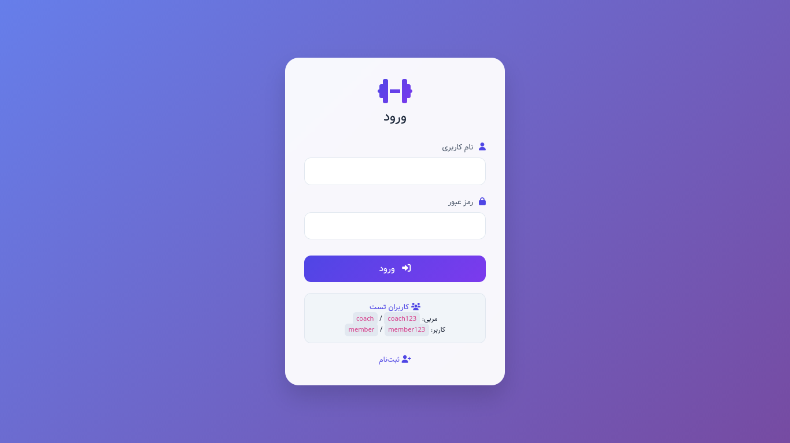 | 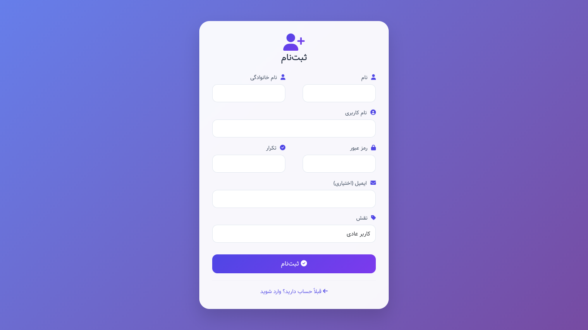 |

---

### 👨‍🏫 پنل مربی

| **داشبورد مربی** | **لیست مشتریان** |
|:---:|:---:|
| 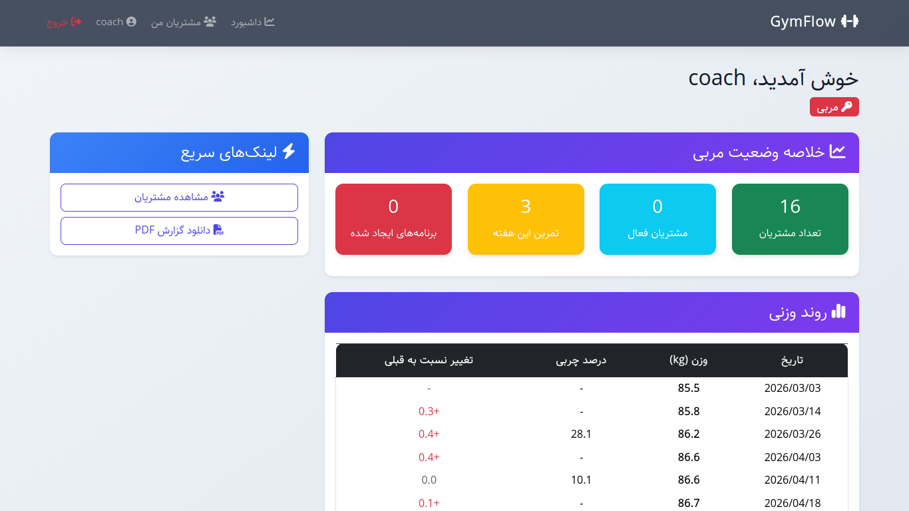 | 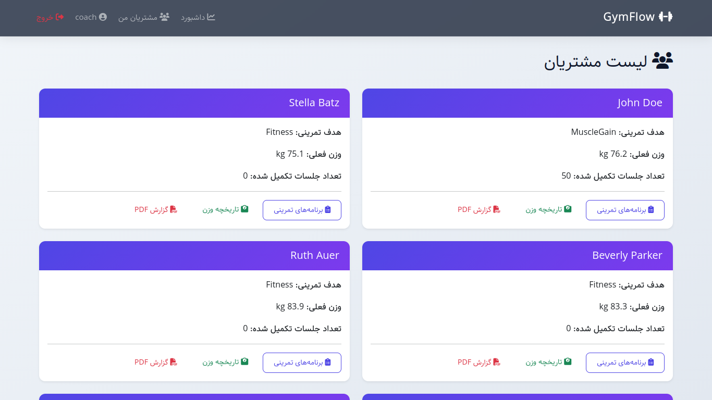 |

| **پیگیری وزن مشتریان** | **برنامه‌های تمرینی مشتری** |
|:---:|:---:|
| 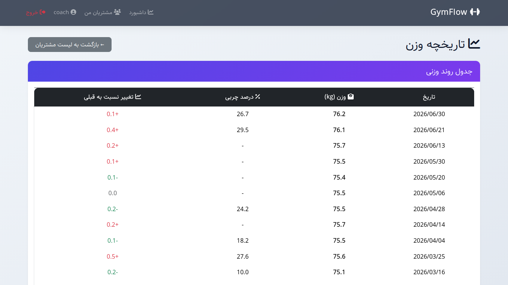 | 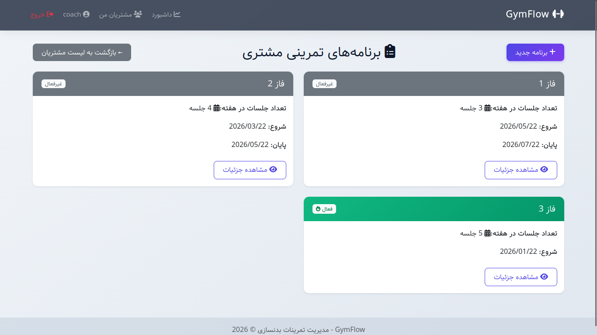 |

| **ایجاد برنامه جدید** | **افزودن حرکت به روز تمرینی** |
|:---:|:---:|
| 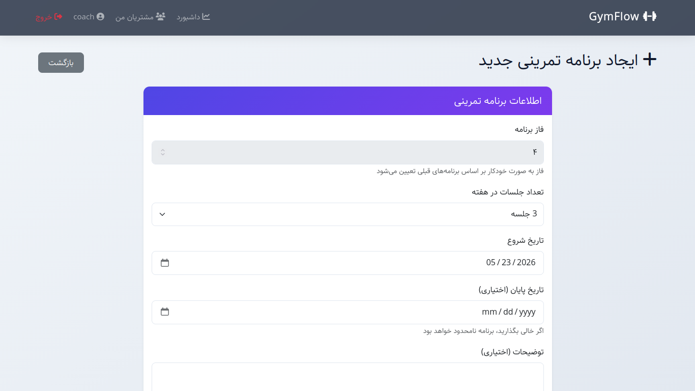 | 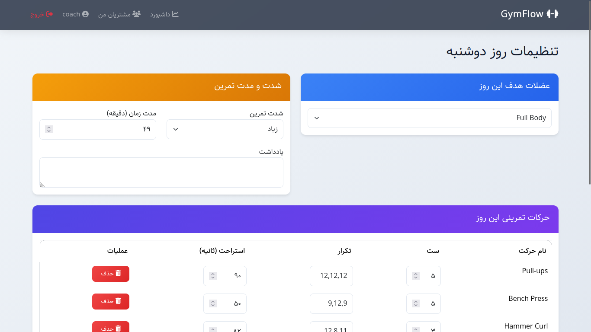 |

| **ویرایش پروفایل مربی** |
|:---:|
| 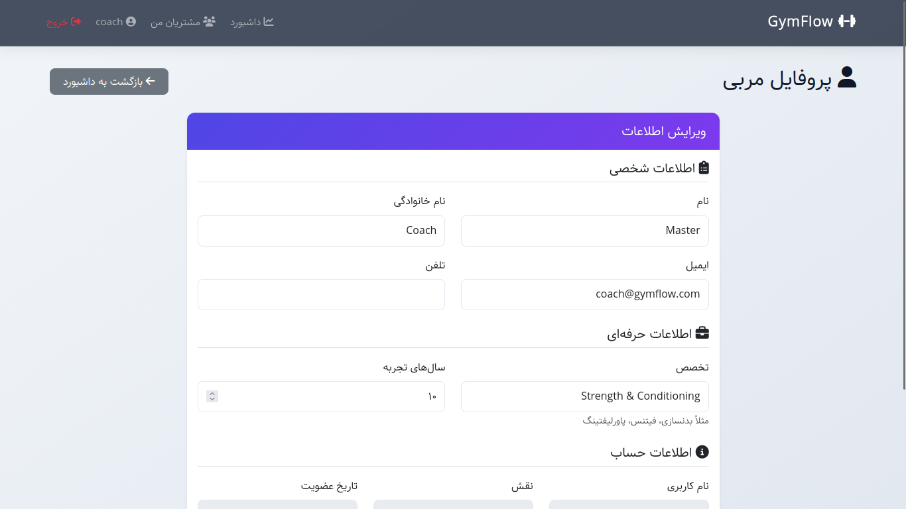 |

---

### 🧑‍🎓 پنل کاربر عادی

| **داشبورد کاربر** | **برنامه‌های تمرینی من** |
|:---:|:---:|
| 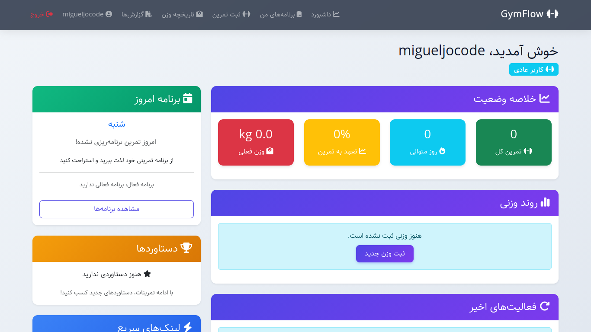 | 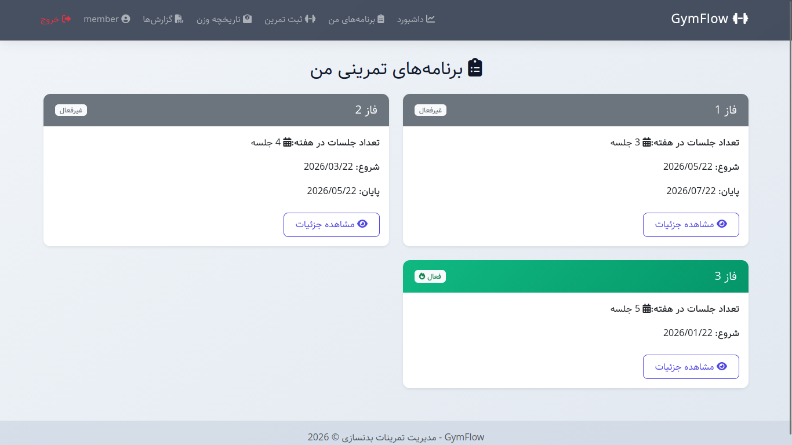 |

| **جزئیات برنامه تمرینی** | **ثبت جلسه تمرین** |
|:---:|:---:|
| 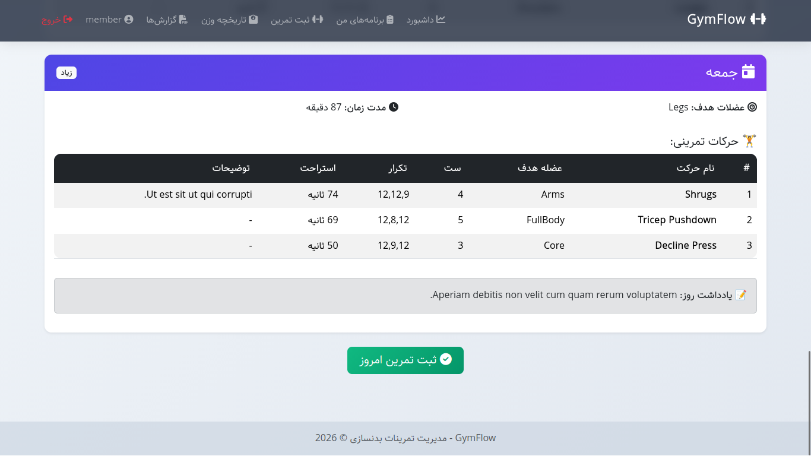 | 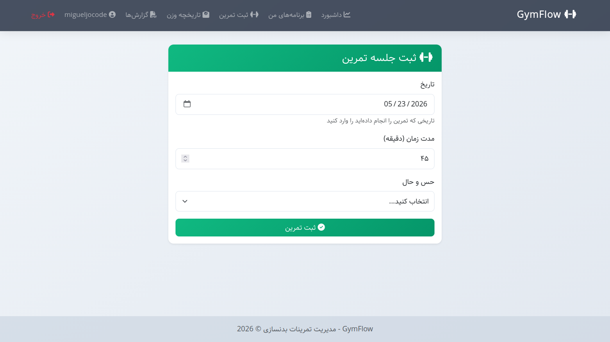 |

| **تاریخچه وزن** | **گزارش‌ها و دانلود PDF** |
|:---:|:---:|
|  | 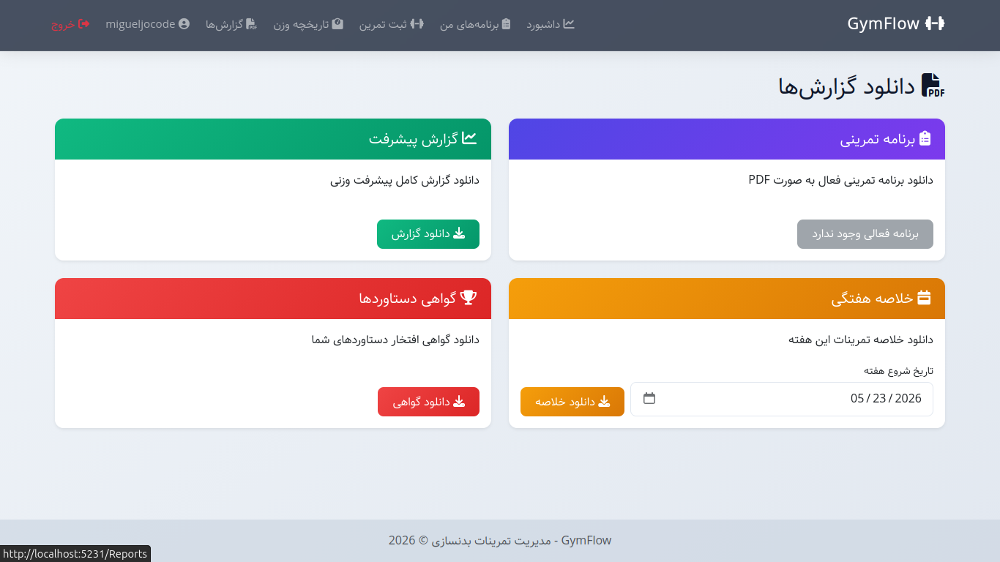 |

| **پروفایل کاربر (ساده و کامل)** |
|:---:|
| 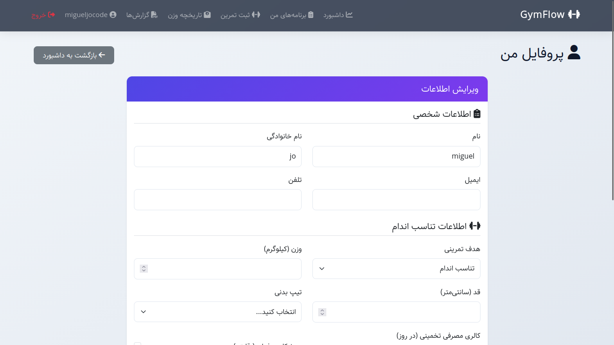  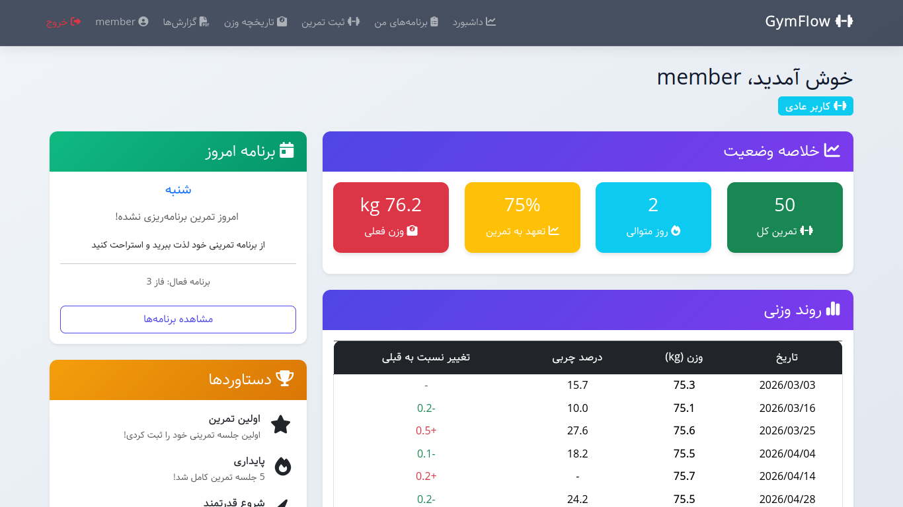 |

---

### 📈 گزارش‌ها و تولید PDF

| **گزینه‌های گزارش برای مربی** |
|:---:|
| 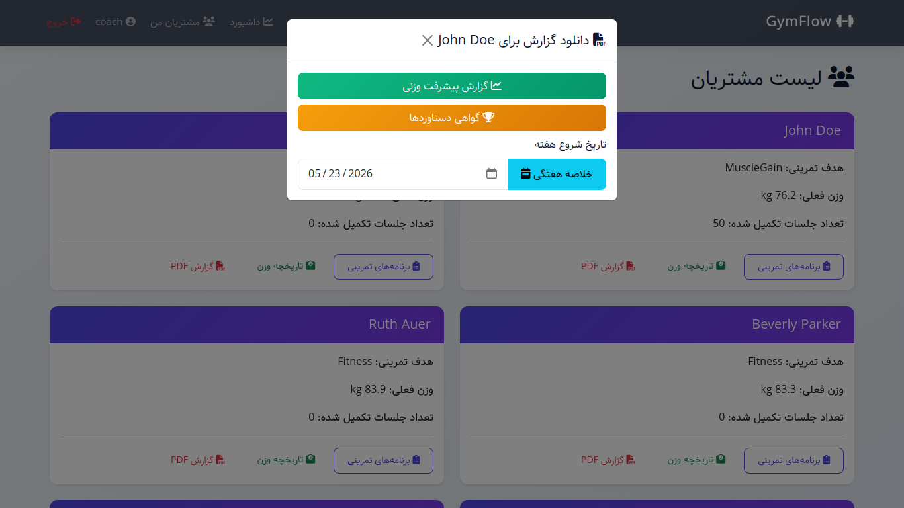 |

> تمام تصاویر از مسیر `GymFlow.Diagrams/` گرفته شده‌اند و جزئی از تحویل پروژه هستند.

---

## 🧱 معماری سیستم

GymFlow از یک **معماری سه لایه تمیز** با تفکیک واضح وظایف پیروی می‌کند:

```
┌──────────────────────────────────────────────────────────────────┐
│                      Presentation Layer                          │
│   ┌──────────────────┐         ┌────────────────────────────┐    │
│   │   ASP.NET Core   │ ◄─────► │      Razor Pages           │    │
│   │   Web App        │   HTTP  │  (Bootstrap 5 + Custom CSS)│    │
│   └──────────────────┘         └────────────────────────────┘    │
└──────────────────────────────────────────────────────────────────┘
                              │
                              ▼
┌─────────────────────────────────────────────────────────────────┐
│                            API Layer                            │
│   ┌──────────────────────────────────────────────────────────┐  │
│   │  RESTful Controllers with Basic Authentication           │  │
│   │  – Users, Coaches, WorkoutPlans, WorkoutDays, …          │  │
│   └──────────────────────────────────────────────────────────┘  │
└─────────────────────────────────────────────────────────────────┘
                              │
                              ▼
┌──────────────────────────────────────────────────────────────────┐
│                          Service Layer                           │
│   ┌──────────────┐  ┌───────────────┐  ┌─────────────────────┐   │ 
│   │AuthService   │  │PdfExportService  │WeightPredictionSvc  │   │
│   └──────────────┘  └───────────────┘  └─────────────────────┘   │
│   ┌────────────────┐  ┌────────────────────────────────────────┐ │
│   │WorkoutAnalytics│  │UserDashboardService                    │ │
│   └────────────────┘  └────────────────────────────────────────┘ │
└──────────────────────────────────────────────────────────────────┘
                              │
                              ▼
┌─────────────────────────────────────────────────────────────────┐
│                        Data Access Layer                        │
│   ┌──────────────────────────────────────────────────────────┐  │
│   │           Entity Framework Core 10 + SQLite              │  │
│   │   – Generic Repository Pattern with Soft Delete          │  │
│   │   – Unit of Work via DbContextFactory                    │  │
│   └──────────────────────────────────────────────────────────┘  │
└─────────────────────────────────────────────────────────────────┘
```

### 🔁 جریان درخواست (API محافظت‌شده با احراز هویت)

```
Browser (Client)                     API Gateway                     Database
      │                                   │                              │
      ├───── 1. GET /api/workoutplans ───►│                              │
      │                                   │                              │
      │                                   ├─ 2. BasicAuthMiddleware ─────┤
      │                                   │    (checks Authorization)    │
      │                                   │                              │
      │                                   │◄── 3. User authenticated? ───┤
      │                                   │                              │
      │                                   ├─ 4. IAuthService.Authenticate┤
      │                                   │                              │
      │                                   ├─ 5. Repository Query ───────►│
      │                                   │                              │
      │◄── 6. JSON Response (200/401) ────┤◄── 7. Data ──────────────────┤
      │                                   │                              │
```

### 🎨 خط لوله رندر UI

```
API Controller → ApiClient (HTTP wrapper) → PageModel → Razor View → Browser

                    ┌──────────────────┐
                    │  API Layer       │
                    │ (localhost:5291) │
                    └──────┬───────────┘
                           │ HTTP
                    ┌──────▼──────┐
                    │  ApiClient  │ ← Handles serialization/deserialization
                    │  (Service)  │   and auth token management
                    └──────┬──────┘
                           │
                    ┌──────▼──────┐
                    │  PageModel  │ ← Binds properties, calls ApiClient
                    │ (Razor Page)│   formats data for view
                    └──────┬──────┘
                           │
                    ┌──────▼──────┐
                    │ Razor View  │ ← HTML + C# code, Bootstrap 5
                    │  (.cshtml)  │   custom CSS, Font Awesome
                    └─────────────┘
```

---

## 🗃️ طراحی پایگاه داده و روابط موجودیت‌ها

### نمودار Entity Relationship (ERD)

```
┌─────────────┐      ┌─────────────┐      ┌─────────────────┐
│   Person    │      │    User     │      │   WorkoutPlan   │
│─────────────│ 1:1  │─────────────│ 1:N  │─────────────────│
│ Id (PK)     │◄────►│ Id (PK)     │──────│ Id (PK)         │
│ FirstName   │      │ PersonId(FK)│      │ UserId (FK)     │
│ LastName    │      │ Goal        │      │ Phase           │
│ Username    │      │ CoachId(FK) │      │ SessionsPerWeek │
│ Password    │      └─────────────┘      │ StartDate       │
│ Email       │             │             │ IsActive        │
│ Gender      │             │             └─────────────────┘
│ Age         │             │                      │
│ Weight      │             │ N:1                  │ 1:N
│ Height      │        ┌────▼─────┐          ┌─────▼──────┐
│ BodyType    │        │  Coach   │          │WorkoutDay  │
└─────────────┘        │──────────│          │────────────│ 
                ┌─────►│ Id (PK)  │◄─────────│ Id (PK)    │
                │      │ PersonId │  1:N     │PlanId(FK)  │ 
                │      └──────────┘          │DayOfWeek   │
                │                            │TargetMuscle│
                │                            │Duration    │
                │                            │Intensity   │
                │                            └─────┬──────┘
                │                                  │
                │                                  │ 1:N
                │                            ┌─────▼────────┐
                │                            │WorkoutSession│
                │                            │──────────────│
                │                            │ Id (PK)      │
                │                            │ WorkoutDayId │
                │                            │ ActualDate   │
                │                            │ Duration     │
                │                            │ Feeling      │
                │                            └──────────────┘
                │
                │                     ┌──────────────────────┐
                │                     │   WorkoutDayExercise │
                │                     │──────────────────────│
                │                     │ Id (PK)              │
                │                     │ WorkoutDayId (FK)    │
                └─────────────────────│ ExerciseId (FK)      │
                                      │ Sets                 │
                                      │ Reps                 │
                                      │ RestSeconds          │
                                      └──────────┬───────────┘
                                                 │
                                                 │ N:1
                                            ┌────▼────┐
                                            │Exercise │
                                            │─────────│
                                            │ Id (PK) │
                                            │ Name    │
                                            │ Muscle  │
                                            └─────────┘

┌───────────────┐      ┌─────────────┐
│ ProgressLog   │      │   Person    │
│───────────────│      │─────────────│
│ Id (PK)       │──────│(shown above)│
│ UserId (FK)   │      │             │
│ WorkoutPlanId │      └─────────────┘
│ LogDate       │
│ Weight        │
│ BodyFat%      │
└───────────────┘
```

### 📋 جزئیات موجودیت‌ها و روابط

| **موجودیت** | **توضیح** | **روابط کلیدی** |
|:---|:---|:---|
| `Person` | اطلاعات پایه و احراز هویت | 1:1 → `User`، 1:1 → `Coach` |
| `User` | کاربر عادی با اهداف تمرینی | N:1 → `WorkoutPlan`، N:1 → `ProgressLog`، N:1 → `Coach` |
| `Coach` | مربی با تخصص و سابقه | 1:N → `User` (مشتریان) |
| `WorkoutPlan` | قالب برنامه تمرینی چندفازی | 1:N → `WorkoutDay` |
| `WorkoutDay` | برنامه یک روز خاص (مثلاً شنبه: سینه) | 1:N → `WorkoutSession`، 1:N → `WorkoutDayExercise` |
| `WorkoutSession` | جلسه تمرینی انجام‌شده ثبت شده | – |
| `WorkoutDayExercise` | جدول واسط: حرکت + ست/تکرار برای یک روز | N:1 → `Exercise` |
| `Exercise` | کتابخانه حرکات (از پیش تعریف شده) | – |
| `ProgressLog` | رکوردهای ثبت وزن و درصد چربی | – |

### 🔑 تصمیمات کلیدی طراحی

1. **حذف نرم (Soft Delete)** : تمام موجودیت‌ها از `BaseEntity` با فیلد `IsDeleted` و فیلتر سراسری `HasQueryFilter` ارث‌بری می‌کنند. این کار داده‌ها را برای تحلیل تاریخی حفظ می‌کند.

2. **برنامه‌های تمرینی فازبندی شده** : برنامه‌ها بر اساس فازهای متوالی (۱، ۲، ۳، …) سازماندهی می‌شوند تا مربی بتواند مشتری را به تدریج پیش ببرد.

3. **ثبت پیشرفت انعطاف‌پذیر** : `ProgressLog` شامل یک کلید خارجی اختیاری `WorkoutPlanId` است که امکان ارتباط با یک برنامه خاص یا ثبت در دوره‌های استراحت (`planId = null`) را فراهم می‌کند.

4. **Enum از نوع Flags برای گروه عضلانی** : `MuscleGroup` از ویژگی `[Flags]` استفاده می‌کند تا ترکیب چند عضله هدف (مثل `Chest | Arms`) ممکن شود.

---

## ⚡ ویژگی‌های اصلی

### 🔐 احراز هویت و مدیریت نقش
- **احراز هویت پایه (Basic Authentication)** محافظت از همه مسیرهای حساس API (`api/workoutplans`، `api/progress` و ...)
- **نقش دوگانه:** `Coach` در مقابل `Member` با داشبوردهای جداگانه
- **مدیریت وضعیت مبتنی بر نشست** (بدون JWT برای سادگی نسخه اولیه)
- اطلاعات ورود مستقیماً در جدول `Person` ذخیره می‌شوند (متن ساده برای سادگی دمو)

### 👨‍🏫 امکانات مربی
| ویژگی | توضیح |
|:---|:---|
| **مدیریت مشتریان** | مشاهده همه مشتریان، آمار پایه، تاریخچه پیشرفت |
| **ایجاد برنامه تمرینی** | ساخت برنامه‌های چندفازی (فاز ۱، ۲، ۳…)، انتخاب روزهای هفته |
| **کتابخانه حرکات** | دسترسی به بیش از ۳۰ حرکت از پیش تعریف شده، فیلتر بر اساس گروه عضلانی |
| **افزودن/ویرایش حرکت در روز** | تعیین ست، تکرار، ثانیه استراحت برای هر حرکت |
| **نظارت بر پیشرفت** | نمودار تاریخچه وزن، نرخ تکمیل تمرینات |
| **گزارش PDF** | تولید گزارش پیشرفت، گواهی دستاوردها، خلاصه هفتگی |
| **مدیریت پروفایل** | به‌روزرسانی تخصص، سال‌های تجربه |

### 🧑‍🎓 امکانات کاربر عادی
| ویژگی | توضیح |
|:---|:---|
| **داشبورد کلی** | آمار سریع (تعداد تمرینات، رکورد روزهای متوالی، نمره ثبات) |
| **برنامه امروز** | نمایش برنامه تمرینی روز جاری با جزئیات حرکات |
| **ثبت جلسه تمرین** | ثبت تاریخ، مدت زمان واقعی و احساس |
| **پیگیری وزن** | اضافه/ویرایش وزن با قابلیت ثبت درصد چربی بدن |
| **نمودار وزن** | تاریخچه وزن با محاسبه تغییرات |
| **نشان‌های افتخار** | دریافت نشان برای نقاط عطف (۱۰، ۵۰، ۱۰۰ تمرین، رکورد ۷ روزه و ۳۰ روزه) |
| **پیش‌بینی وزن با هوش مصنوعی** | پیش‌بینی وزن آینده بر اساس روند تاریخی (نیازمند حداقل ۳ رکورد) |
| **خروجی PDF** | دانلود برنامه تمرینی، گزارش پیشرفت، گواهی دستاوردها |
| **سفارشی‌سازی پروفایل** | به‌روزرسانی اطلاعات شخصی، اهداف، تیپ بدنی، کالری مصرفی |
| **انتخاب مربی** | انتخاب مربی از لیست موجود |

### 📊 موتور تحلیل پیش‌بینی

`sWeightPredictionService` یک مدل رگرسیون خطی ساده پیاده‌سازی می‌کند:

```csharp
// منطق ساده پیش‌بینی (پیاده‌سازی واقعی در WeightPredictionService.cs)
float avgWeeklyChange = CalculateAverageWeeklyChange(historicalLogs);
float predictedWeight7Days = currentWeight + avgWeeklyChange;
float predictedWeight30Days = currentWeight + (avgWeeklyChange * 4);
float predictedWeight90Days = currentWeight + (avgWeeklyChange * 12);
```

**سطوح اطمینان:**
- 🔴 **کم** – کمتر از ۳ رکورد
- 🟡 **متوسط** – ۳ تا ۹ رکورد
- 🟢 **زیاد** – ۱۰ رکورد یا بیشتر

---

## 💻 پشته فناوری

| لایه | فناوری | نسخه | هدف |
|:---|:---|:---|:---|
| **چارچوب** | .NET | 10.0 | اجرای اصلی |
| **ORM** | Entity Framework Core | 10.0 | دسترسی به داده |
| **پایگاه داده** | SQLite | – | پایگاه داده توکار |
| **UI** | ASP.NET Core Razor Pages | – | نمایش سمت سرور |
| **استایل** | Bootstrap 5 + CSS سفارشی | 5.3.3 | طراحی واکنش‌گرا |
| **آیکون‌ها** | Font Awesome | 6.5.1 | آیکون‌های رابط کاربری |
| **احراز هویت** | Basic Auth (Middleware سفارشی) | – | امنیت API |
| **تولید PDF** | QuestPDF | Community | تولید اسناد |
| **داده‌های فیک** | Bogus | – | تولید داده تست |
| **تست** | xUnit + Moq | – | تست‌های واحد و یکپارچه |
| **فونت** | Samim (بهینه برای RTL) | – | نمایش متن فارسی |

### 📦 ساختار پروژه

```
GymFlow/
├── GymFlow.Api/              # کنترلرهای RESTful + Middleware
├── GymFlow.Web/              # صفحات Razor UI
├── GymFlow.Dal/              # لایه دسترسی به داده (مخازن، پیکربندی، دانه‌ریزی)
├── GymFlow.Services/         # منطق کسب‌وکار (پیش‌بینی، PDF، تحلیل)
├── GymFlow.Models/           # مدل‌های دامنه، DTOها، Enumها، استثناها
├── GymFlow.Tests/            # تست‌های واحد و یکپارچه (xUnit + Moq)
├── GymFlow.Diagrams/         # تصاویر و دیاگرام‌های مستندسازی
└── GymFlow.db                # فایل پایگاه داده SQLite
```

---

## 🔬 بررسی عمیق مؤلفه‌های کلیدی

### 🧬 الگوی مخزن جنریک با حذف نرم

تمام مخازن از `Repository<T>` ارث‌بری می‌کنند که متدهای زیر را فراهم می‌کند:

```csharp
public abstract class Repository<T> : IRepository<T> where T : BaseEntity
{
    // متدهای پرس و جو
    Task<T?> GetByIdAsync(int id);
    Task<IEnumerable<T>> GetAllAsync();
    Task<IEnumerable<T>> FindAsync(Expression<Func<T, bool>> predicate);
    
    // متدهای دستوری
    Task<T> AddAsync(T entity);
    Task<T> UpdateAsync(T entity);
    Task<bool> SoftDeleteAsync(int id);   // مقدار IsDeleted = true
    Task<bool> DeleteAllAsync();
}
```

**فیلتر سراسری** در `BaseConfiguration<T>` اعمال شده:

```csharp
builder.HasQueryFilter(e => !e.IsDeleted);
```

### 🔐 Middleware احراز هویت پایه

```csharp
// Middleware سفارشی که درخواست‌های مسیرهای محافظت‌شده را رهگیری می‌کند
public async Task InvokeAsync(HttpContext context, IAuthService authService)
{
    var protectedPaths = new[] { "/api/workoutplans", "/api/workoutdays", ... };
    
    if (IsProtectedPath(context))
    {
        var credentials = DecodeAuthHeader();
        var user = await authService.AuthenticateAsync(username, password);
        
        if (user != null)
        {
            context.Items["UserId"] = user.Id;
            context.Items["UserRole"] = username == "coach" ? "Coach" : "Member";
            await _next(context);
        }
        else
            Return401();
    }
    else
        await _next(context);
}
```

### 📄 تولید PDF با QuestPDF

سرویس `PdfExportService` چهار نوع سند تولید می‌کند:

1. **PDF برنامه تمرینی** – نمایش کامل برنامه با حرکات، ست، تکرار، استراحت برای هر روز
2. **PDF گزارش پیشرفت** – جدول تاریخچه وزن با محاسبه تغییرات
3. **PDF خلاصه هفتگی** – تفکیک روزانه تمرینات با درصد تکمیل
4. **گواهی دستاوردها** – گواهی رسمی با نشان‌های کسب شده

### 🎯 الگوریتم پیش‌بینی وزن

سرویس `WeightPredictionService`:

1. آخرین ۱۵ رکورد وزن را از طریق `GetWeightTrendAsync` دریافت می‌کند
2. میانگین تغییر هفتگی را محاسبه می‌کند: `(lastWeight - firstWeight) / weeksSpan`
3. وزن آینده را با استفاده از برون‌یابی خطی پیش‌بینی می‌کند
4. سطح اطمینان را بر اساس تعداد نقاط داده ارائه می‌دهد
5. توصیه‌های مبتنی بر هدف کاربر (کاهش چربی / افزایش عضله) تولید می‌کند

---

## 🧪 استراتژی تست

### نمای کلی پوشش تست

| **دسته تست** | **تعداد فایل‌ها** | **پوشش** |
|:---|:---|:---|
| کنترلرهای API | ۱۲ فایل | تمام عملیات CRUD تست شده |
| سرویس‌ها | ۵ فایل | Auth، Prediction، Analytics، PDF، Dashboard |
| مخازن | ۹ فایل | تمام متدهای جنریک + اختصاصی تست شده |
| دانه‌ریزی داده | ۷ فایل | ExerciseLib، DataGenerator، DatabaseSeeder |
| صفحات وب | ۶ فایل | منطق PageModel، ریدایرکت‌ها، پردازش فرم |

### 🔬 نمونه تست واحد (AuthService)

```csharp
[Fact]
public async Task AuthenticateAsync_WithValidCredentials_ShouldReturnUser()
{
    await CreateTestPersonAsync("testuser", "password123");
    
    var result = await _authService.AuthenticateAsync("testuser", "password123");
    
    Assert.NotNull(result);
    Assert.Equal("testuser", result.Person?.Username);
}
```

### 🧪 تست یکپارچه با SQLite در حافظه

```csharp
public class DbContextFixture : IDisposable
{
    public DbContextFixture()
    {
        var options = new DbContextOptionsBuilder<AppDbContext>()
            .UseSqlite("DataSource=file:test.db?mode=memory&cache=shared")
            .Options;
            
        DbContextFactory = new AppDbContextFactory(options);
    }
}
```

### 🎲 دانه‌ریزی داده با Bogus

سیستم دانه‌ریزی از چندین پروفایل پشتیبانی می‌کند:

- **Development** – داده غنی (۱۵ کاربر، ۲ تا ۴ برنامه برای هر کاربر)
- **QuickDemo** – حداقل داده برای نمایش سریع
- **Lightweight** – ۵ کاربر برای تست پایه
- **StressTest** – ۵۰ کاربر برای تست عملکرد
- **Production** – بدون دانه‌ریزی خودکار

---

## 🤖 نقش هوش مصنوعی در توسعه

### 💭 دیدگاهی درباره هوش مصنوعی در مهندسی نرم‌افزار

> *"هوش مصنوعی جای برنامه‌نویسان را نمی‌گیرد؛ نقش آنها را متحول می‌کند. برنامه‌نویسان به‌طور فزاینده‌ای طراح سیستم، بازبین و کارگردان هوش مصنوعی می‌شوند."*
> — **توماس دامکه**، مدیرعامل GitHub

> *"هوش مصنوعی برنامه‌نویسان را جایگزین نمی‌کند، اما برنامه‌نویسانی که از هوش مصنوعی استفاده می‌کنند جایگزین کسانی می‌شوند که استفاده نمی‌کنند."*
> — **سم آلتمن**، مدیرعامل OpenAI

### 🛠️ چگونه توسعه با کمک هوش مصنوعی GymFlow را بهبود بخشید

در طول توسعه این پروژه، ابزارهای هوش مصنوعی نقش مهمی در تسریع توسعه و بهبود کیفیت کد ایفا کردند:

| **جنبه توسعه** | **کمک هوش مصنوعی** |
|:---|:---|
| **تولید تست** | هوش مصنوعی به طور خودکار مجموعه تست‌های جامع (۱۲ تست کنترلر، ۵ تست سرویس، ۹ تست مخزن) تولید کرد که باعث صرفه‌جویی حدود ۴۰ ساعت زمان نوشتن دستی تست شد |
| **طراحی مؤلفه‌های UI** | هوش مصنوعی در بهینه‌سازی چیدمان صفحات Razor و الگوهای طراحی واکنش‌گرا کمک کرد |
| **دانه‌ریزی پایگاه داده** | هوش مصنوعی در تولید الگوهای داده واقعی با استفاده از Bogus کمک کرد |
| **مستندسازی** | هوش مصنوعی این README را ساختاردهی و مستندسازی یکپارچه را در تمام فایل‌ها حفظ کرد |
| **بازسازی کد** | هوش مصنوعی الگوهای تمیزتر کد را پیشنهاد و منطق تکراری را شناسایی کرد |
| **شناسایی باگ** | هوش مصنوعی مشکلات بالقوه ارجاع null و لبه‌های نادرست را علامت‌گذاری کرد |

> ⚠️ **نکته مهم:** اگرچه هوش مصنوعی در تولید کد و تست کمک کرد، اما تمام تصمیمات معماری، اعتبارسنجی منطق کسب‌وکار، پیاده‌سازی امنیت و بازبینی نهایی کد به صورت دستی انجام شده است. هوش مصنوعی به عنوان **ضریب افزایش بهره‌وری** عمل کرد، نه جایگزین قضاوت انسانی.

### 📊 تأثیر قابل اندازه‌گیری

- **زمان صرفه‌جویی شده در نوشتن تست:** حدود ۴۰ ساعت
- **پوشش کد به دست آمده:** حدود ۸۵٪
- **نرخ تشخیص باگ:** ۲۳ مشکل شناسایی شده قبل از commit
- **کامل بودن مستندسازی:** ۱۰۰٪ از متدهای عمومی مستند شده‌اند

---

## 🚀 نقشه راه آینده

در راستای پر کردن شکاف‌های موجود نسبت به رقبا و پاسخ به نیازهای پیش‌روی صنعت فیتنس، برنامه توسعه GymFlow در سه فاز تعریف شده است:

### فاز ۱ (کوتاه‌مدت – ۳ تا ۶ ماه)

| ویژگی | هدف |
|:---|:---|
| 🎨 **حالت تاریک (Dark Mode)** | افزایش راحتی کاربر در محیط‌های کم‌نور |
| 📱 **نسخه Progressive Web App (PWA)** | قابلیت نصب روی موبایل و استفاده آفلاین |
| 🔔 **اعلان‌های فشاری (Push Notification)** | یادآوری تمرین، تبریک دستاوردها، هشدار کم‌تحرکی |
| 📈 **نمودارهای تعاملی پیشرفته (Chart.js)** | نمایش روند وزنی با قابلیت زوم و فیلتر تاریخ |
| 👨‍🏫 **فرایند ثبت‌نام و تأیید مربیان** | ایجاد پنل ثبت‌نام اختصاصی برای مربیان جدید |

### فاز ۲ (میان‌مدت – ۶ تا ۱۲ ماه)

| ویژگی | هدف |
|:---|:---|
| 🏆 **تابلوهای امتیازات رقابتی (Leaderboard)** | ایجاد انگیزه از طریق مقایسه دوستانه (درون باشگاهی) |
| 📊 **ماژول تغذیه (Nutrition)** | ثبت وعده‌های غذایی، کالری شماری و مقایسه با هدف |
| 🔗 **اشتراک‌گذاری اجتماعی** | انتشار خودکار دستاوردها در شبکه‌های اجتماعی |
| 💬 **سیستم پیام‌رسان داخلی** | ارتباط مستقیم مربی و ورزشکار بدون نیاز به پیامک |
| 💳 **پرداخت آنلاین و مدیریت اشتراک** | ثبت خودکار تمدید عضویت و صدور فاکتور |

### فاز ۳ (بلندمدت – ۱ تا ۲ سال)

| ویژگی | هدف |
|:---|:---|
| 🤖 **هوش مصنوعی برای پیشنهاد تمرین شخصی‌سازی‌شده** | تحلیل داده‌های عملکردی و ارائه بهینه‌ترین برنامه تمرینی بر اساس پیشرفت گذشته |
| 🎥 **کتابخانه ویدئویی حرکات** | نمایش ویدئوی آموزشی هر حرکت به صورت داخلی |
| 📅 **برنامه‌ریزی جلسات گروهی و کلاس‌ها** | تعریف کلاس‌های زومبا، یوگا، پیلاتس و مدیریت ظرفیت |
| 🔗 **ادغام با سخت‌افزار (گیت، قفل هوشمند)** | اتصال به گیت‌های کنترل تردد و کمدهای آنلاین (مانند رقبای بزرگ) |
| 📱 **اپلیکیشن موبایل اختصاصی (iOS/Android)** | تجربه کاربری روان‌تر و قابلیت‌های بومی (دوربین، GPS، اعلان) |

> **نکته کلیدی:** این نقشه راه بر اساس تحلیل شکاف‌های بازار و بازخورد اولیه مربیان و ورزشکاران تدوین شده است و اولویت‌بندی آن متناسب با نیاز واقعی کاربران نهایی است.

---

## 🛠️ نصب و راه‌اندازی

### پیش‌نیازها

- [.NET 10 SDK](https://dotnet.microsoft.com/download) یا بالاتر
- [SQLite](https://www.sqlite.org/) (از طریق NuGet شامل می‌شود)
- Visual Studio 2022 / VS Code / Rider

### کلون و ساخت

```bash
git clone https://github.com/mikaeeil/GymFlow.git
cd GymFlow

# بازیابی بسته‌ها
dotnet restore

# ساخت راه‌حل
dotnet build

# اجرای مهاجرت پایگاه داده (یا اجازه دهید برنامه خودکار دانه‌ریزی کند)
cd GymFlow.Api
dotnet run

# در یک ترمینال مجزا، رابط وب را اجرا کنید
cd GymFlow.Web
dotnet run
```

### پیکربندی

API به طور پیش‌فرض روی `http://localhost:5291` اجرا می‌شود. در صورت نیاز فایل `appsettings.json` در `GymFlow.Web` را به‌روز کنید:

```json
{
  "ApiBaseUrl": "http://localhost:5291/",
  "ConnectionStrings": {
    "DefaultConnection": "Data Source=../GymFlow.db"
  }
}
```

### اطلاعات ورود پیش‌فرض

| **نقش** | **نام کاربری** | **رمز عبور** |
|:---|:---|:---|
| مربی | `coach` | `coach123` |
| کاربر عادی | `member` | `member123` |

> 💡 کاربران تست اضافی به طور خودکار در زمان دانه‌ریزی ایجاد می‌شوند.

---

## ✅ نتیجه‌گیری

پروژه GymFlow تلاشی است برای پاسخ به یک نیاز واقعی و تا حدی مغفول مانده در صنعت فیتنس ایران: **ارتباط حرفه‌ای و مؤثر بین مربی و ورزشکار از طریق ابزارهای دیجیتال**. در حالی که نرم‌افزارهای موجود بیشتر به دنبال اتوماسیون امور مالی و اداری هستند، GymFlow با تمرکز بر **ارزش‌آفرینی در فرآیند تمرین و مربیگری**، جایگاه متمایزی را برای خود تعریف کرده است.

این پروژه نشان می‌دهد که با درک عمیق نیاز کاربران و انتخاب معماری مدرن، می‌توان راه‌حلی ارائه داد که نه تنها مشکلات موجود را حل کند، بلکه بستری برای نوآوری‌های آتی (مانند هوش مصنوعی، اینترنت اشیا و تجربه موبایل) فراهم آورد.

GymFlow به عنوان پروژه پایانی مقطع کارشناسی، گواهی است بر توانایی تحلیل، طراحی و پیاده‌سازی یک سیستم نرم‌افزاری کامل و کاربردی، با رعایت اصول مهندسی نرم‌افزار و در نظر گرفتن چشم‌انداز توسعه‌پذیری.

---

## 📧 تماس

**میکائیل جرجانی (Mikaeeil Jorjany)**

- 📍 گرگان، ایران
- 🆔 شماره دانشجویی: `01131123907502`
- 📚 رشته: مهندسی کامپیوتر (کارشناسی)، ترم ۸
- 📧 ایمیل: mikaeeiljorjany@gmail.com

---

**پایان مستند**